# 💎 Diva Jewellery App

A modern jewellery e-commerce mobile application built with React Native, Expo, TypeScript, and Firebase.

## ✨ Features

### Authentication
- Email & Password Sign Up/Login
- Google Sign In
- Persistent Authentication

### Shopping Experience
- Browse jewellery collections
- Category-based products
- Product details page
- Search products
- Wishlist management

### Cart & Checkout
- Add to Cart
- Update Quantity
- Order Summary
- Checkout Flow
- Order Success Screen

### Order Management
- Place Orders
- View Order History
- View Order Details
- Order Status Tracking

### User Profile
- Account Details
- Profile Update
- Phone Number Validation
- Address Validation
- Logout

## 🛠️ Tech Stack

### Frontend
- React Native
- Expo
- TypeScript
- Expo Router
- React Native Paper

### Backend
- Firebase Authentication
- Cloud Firestore

### State Management
- Context API
  - AuthContext
  - CartContext
  - WishlistContext

## 📱 Screens

- Home
- Categories
- Product Details
- Wishlist
- Cart
- Checkout
- Orders
- Profile
- Login
- Register

## 📂 Project Structure

```text
Diva-Jewellery-App/
├── app/
├── assets/
├── src/
│   ├── components/
│   ├── config/
│   ├── context/
│   ├── data/
│   └── services/
├── package.json
└── README.md
```
## 🔥 Firebase Setup
```text
Create a Firebase Project.
Enable Authentication.
Enable Firestore Database.
Add your Firebase configuration.
Add google-services.json.
```
## 🎯 Future Improvements
```text
Product filtering
Payment gateway integration
Admin dashboard
Product reviews & ratings
Push notifications
Seller panel
```
## 📸 Screenshots

### Splash Screen


### Register Screen
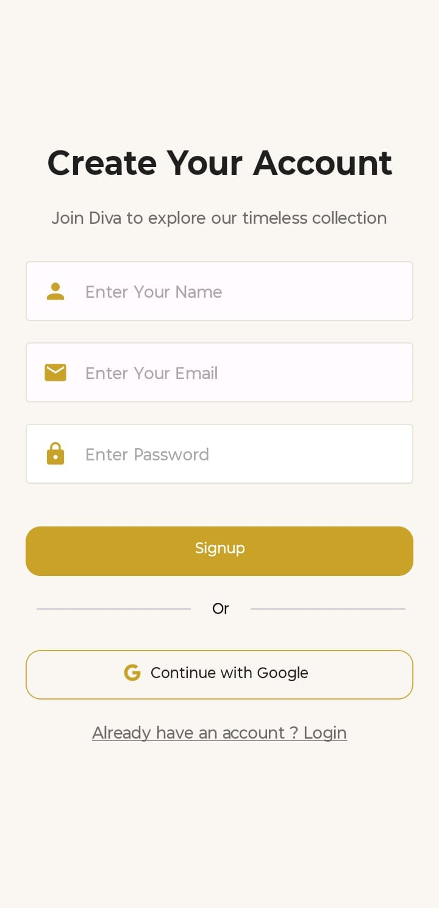

### Login Screen
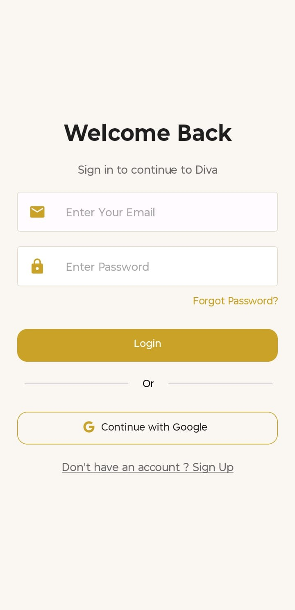

### Home Screen
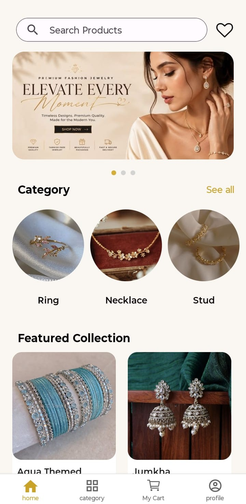

### Category Screen
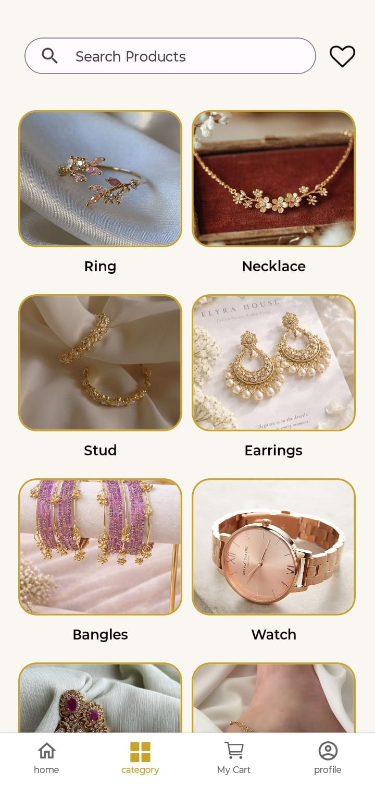

### Product Screen
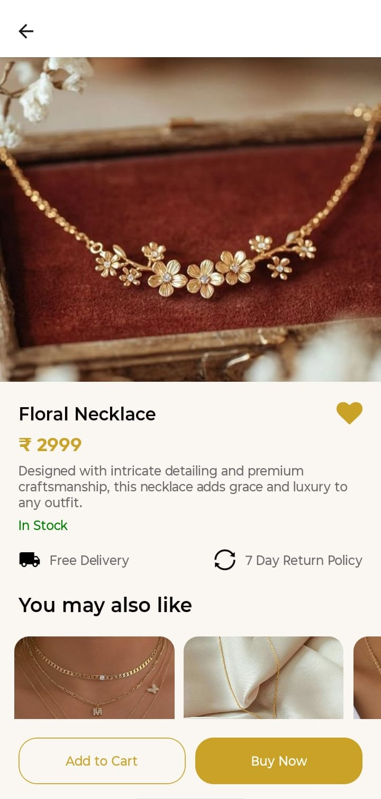

### Wishlist
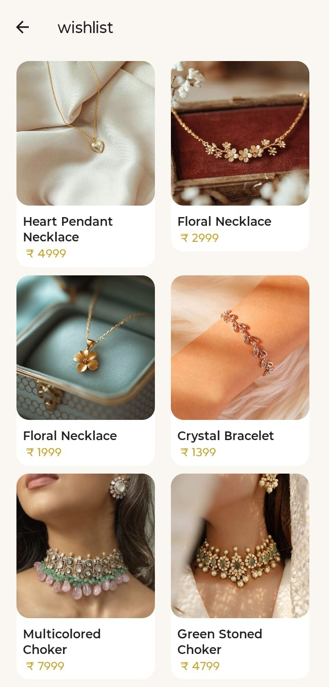

### Cart Screen
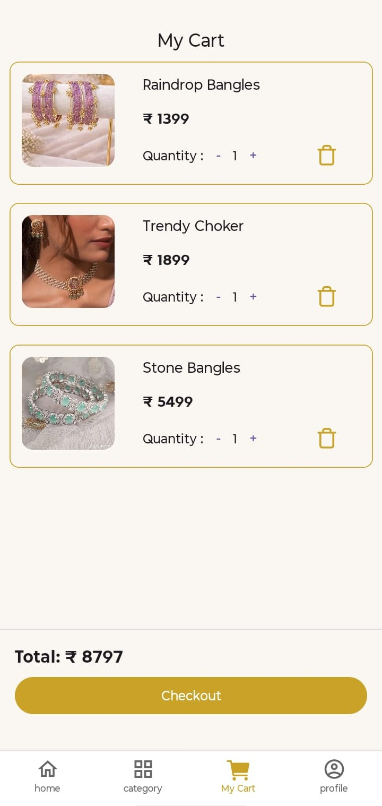

### Checkout Screen
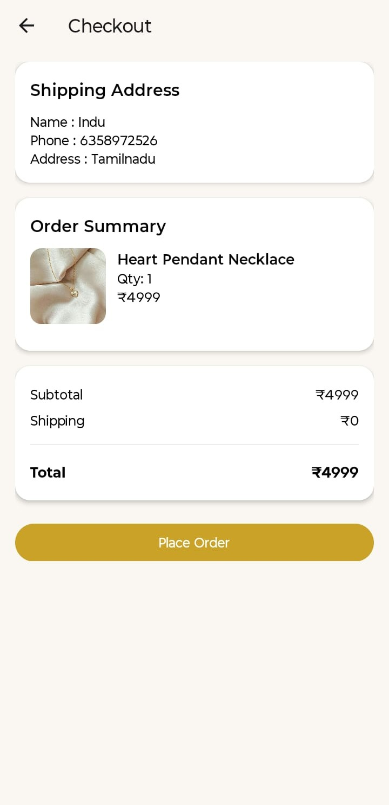

### Order Screen
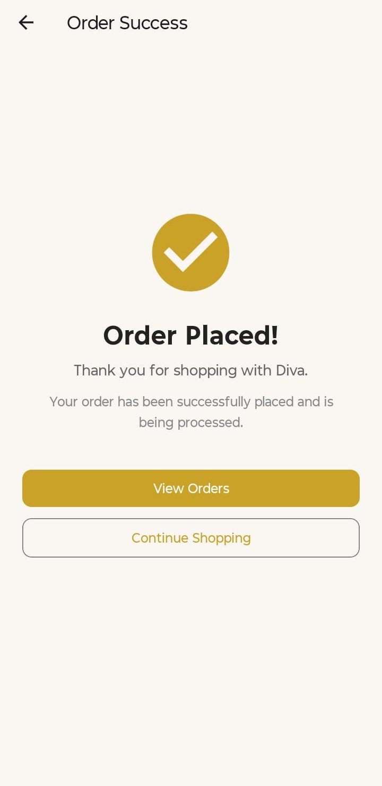

### Order History 
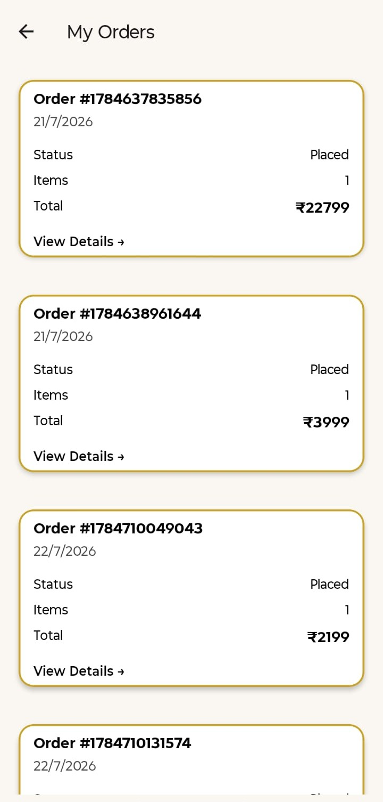

### Order Details Screen
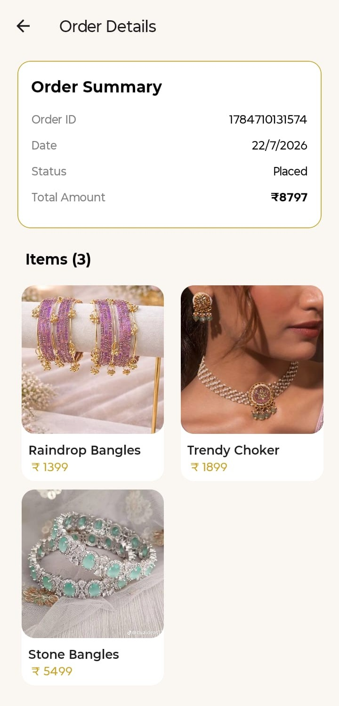

### Profile Screen
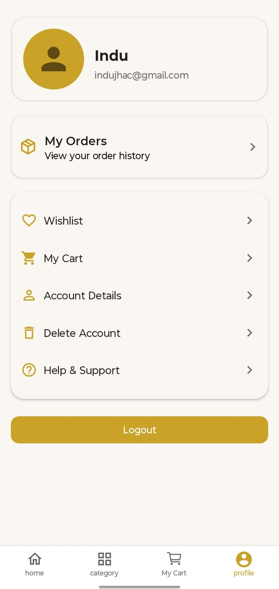


## 👩‍💻 Author
```text
Indujha C
React Native Developer
```
GitHub: https://github.com/indu2809
